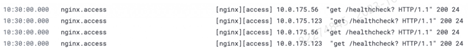
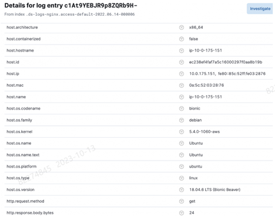
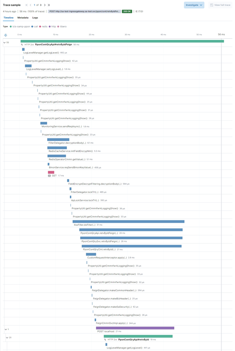
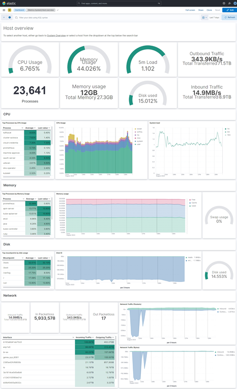

# Elastic Stack 시작하기

## 1) Elastic Stack 개요

Elastic Stack은 Elasticsearch, Logstach, Kibana의 앞글자를 따서 ELK Stack으로 불리던 기존의 아키텍처에서 Beats 제품군이 추가된 Elastic의 제품군으로 다양한 유형의 데이터를 대규모로 수집, 분석, 검색 및 시각화 하는 모듈을 포함한 데이터 플랫폼이다.

크게 수집 영역, 분석 영역, 표현 영역으로 구분되며 본 교육에서 사용할 v8.10.4 버전에서는 BEATS, Logstach 등 수집기 및 다양한 솔루션 데이터를 수집할 수 있도록 Integration 이란 통합 기능을 제공하고 있다.

 

 

 

### Elastic 솔루션별 제공 기능

Elastic의 솔루션 종류가 점점 많아짐에 따라 최근에는 아래 4개의 카테고리로 구분하여 각 솔루션을 배치하였고 각 카테고리별 제공되는 기능은 다음과 같다. 

- Enterprise     Search : App Search, Site Search, Workplace Search 기능을 제공하며 검색 전문 SaaS 서비스 구축이 목적인 경우 사용한다. (Enterprise     Search는 Elasticsearch 미 포함)

- Observability     : 통합 가시성 (Logs, Metrics, 가동 시간 데이터, 애플리케이션 추적(APM), 사용자 경험 데이터(RUM) 및 Synthetic 데이터) 구축 필요 시 사용한다.

- Security :     단말 시스템 보안 강화, SIEM(보안 이벤트 분석) 등 보안 위협을 실시간으로 예방하고, 탐지하며 대응할 수 있는 기능을 제공한다.

- Analytics     : 수집된 데이터를 사용하여 Dashboard, Discover 등 다양한 시각화 기능을 제공한다.

  

본 교육에서는 Observability, Analytics 기능 위주로 진행되며 Elasticsearch, kibana, fleet, elastic agent 설치 후 데이터 수집/검색 및 수집된 데이터 기반으로 대시보드를 생성하는 순서로 실습이 진행된다.

### Elastic Stack 구성

Elastic Stack을 구성하는 세부 Stack은 다음과 같다.

- Kibana (Explore, Visualize, Engage) : Elastic Stack을 쉽게 사용하기 위한 툴로 데이터 분석, 시각화, Elastic Stack에 대한 모니터링 및 설정관리를 위해 사용한다.
- Elasticsearch (Store, Search, Analyse) : 검색 및 분석 엔진으로 수집한 데이터를 인덱스에 저장하고 검색이 가능하도록 제공한다.
- Integration (Connect, Collect, Alert) : 기존 Beats 제품군 및 Logstash를 포함하여 다양한 솔루션과의 Integration 기능을 제공한다.

#### **Kibana (Explore, Visualize, Engage)**

Kibana에서는 수집된 데이터를 다양한 방법으로 분석 가능하도록 시각화 기능을 제공한다.

 

#### **Elasticsearch (Store, Search, Analyze)**

Elasticsearch는 데이터를 수집, 검색(쿼리) 및 분석할 수 있는 데이터 플랫폼(초고속 DBMS)이다.

> **RDBMS와 Elasticsearch에서 데이터를 검색하는 방법의 차이**

* RDBMS에서 텍스트로 데이터를 검색
  * Like 연산, 즉 패턴 매칭으로 데이터를 탐색한다. 
  * 테이블에 저장된 모든 데이터를 탐색하며 해당 컬럼의 데이터가 주어진 패턴과 일치하는지 여부를 검사하면서 결과를 필터링한다. 

* Elasticsearch : 역 인덱스 (Inverted Index) 방식으로 데이터를 저장하고 검색한다. 
  * 역 인덱스 
    * 일반적으로 RDBMS에서의 인덱스는 책 앞 부분의 목차로 빗댄다. 
    * 역 인덱스는 책 뒷부분의 찾아보기에 빗댈 수 있다. 즉, 특정 키워드가 어떤 페이지들에서 등장했는지를 나타낸다. 
    * 다시 말해 역 인덱스는 해시맵 형태의 데이터 구조로, Document의 텍스트를 여러 개의 키워드로 쪼갠 뒤, 각 키워드를 key 값으로, 해당 키워드가 등장한 Document id를 value 값으로 저장한다.

* 예를 들어, ‘hudi’ 라는 단어가 5번째, 6,520번째,  10,000번째 도큐먼트에서 등장한다고 가정하자. 일반적인 RDBMS는 `LIKE %hudi%` 로 검색했을 때 10,000번째 행까지 탐색을 하겠지만, 역 인덱스 구조에서는 ‘hudi’ 라는 키워드가 가리키는  도큐먼트가 무엇인지 확인만 하면 된다.
  
* 따라서 데이터가 많아지더라도 찾아가야 할 행이 늘어나는 것이 아니라 역 인덱스가 가리키는 document id의 배열 값이 추가되는 것일 뿐이기 때문에 큰 속도의 저하 없이 빠른 속도로 검색이 가능하다. 

 

#### **Integration (Connect, Collect, Alert)** 

Integration을 이용하면 Elastic에서 기본적으로 제공하는 다양한 솔루션과 손쉽게 연계하여 데이터 수집이 가능하다

- Elastic에서 제공하는 Integration 목록

 

 

### Elastic 데이터 처리 흐름

Elastic의 데이터 처리 흐름은 Source에서 수집기를 통해 데이터 수집 후 원하는 형태로 전처리(Parsing) 작업을 진행하여 시각화하여 UI로 보여준다.

 

## 모니터링 기본 개념

### Logging, Tracing, Monitoring(Metric) 의 개념 및 차이점

Logging, Tracing 및 Monitoring(Metric)은 모두 시스템의 정확성을 보장하고, 문제가 발생할 때 무엇이 잘못되었는지 추적하고, 전체 기능을 개선하는 데 도움이 되는 모든 방법이다.

#### Logging

Logging 은 Event 에 대한 단순기록을 의미하며 human readable 할 수도 있고, json 형태의 기록일 수도 있다.

로깅의 목적은 오류 보고 및 관련 데이터를 중앙 집중식으로 추적하는 것으로 이벤트 로깅 또는 결과적으로 발생하는 실제 로그 파일 을 모두 참조할 수 있으며 로그 파일은 오류 또는 상태 변환과 같은 응용 프로그램 또는 시스템 내의 개별 이벤트를 표시할 수 있다.

> **예시**

* 현재 동작 상황을 기록하는, 사람이 해석할 수 있는 데이터 

  * 문제 발생시 조사를 시작할 수 있지만 엄청 자세한 정보는 아님. access_log, error_log 등
    < 일반적인 access_log. 한줄 텍스트 형태  > 

    

    

* 구조화된 기계 데이터 

  < 구조화된 로그를 사용한 데이터. 주로 json 을  사용함 >

  

#### Tracing

Tracing 은 특정 사용자의 하나의 연결된 이벤트들의 기록으로 Logging이 개별 이벤트 트리거 로그에 대한 개요를 제공하는 반면, Tracing은 애플리케이션에 대한 훨씬 더 넓고 지속적인 보기를 포함한다.

추적의 목표는 프로그램의 흐름과 데이터 진행을 확인하는 것으로 Tracing은 Logging보다 Event에 대해 훨씬 더 자세하게 기록한다.

많은 경우에 Tracing 은 전체 앱 스택을 통한 단일 사용자의 여정을 나타내며 개발자는 프로세스의 최적화를 위해 스택을 추적하여 병목 현상을 식별하고 성능 개선에 집중할 수 있다.

> **예시**

#### Monitoring(Metric)

Monitoring 은 Metric 을 측정하고, 계산식에 따라서 진단 하는 것으로 Application에서 일정 항목에 대해서 수치를 측정하고 집계 및 분석 하여 시스템 작동 시 분석되는 수치를 Metric 이라고 한다.

이러한 유형의 모니터링은 시스템이 제대로 작동하지 않을 때 Email, SMS 연계 등을 통해 개발자에게 위험을 알린다.

비용이 문제가 되지 않으면 모든 서비스를 계측하고 Monitoring 하는 것이 운영 안정성을 높일 수 있다.

> **예시**

* Elastic stack에서는 Log / Trace / Monitoring 대신 Logs / APM / Metrics / Uptime 으로 구분한다.
  * Uptime : 외부 Heartbeat를 서비스 엔드포인트로 보냄으로써 가용성모니터링 
  * APM : 애플리케이션 내에서 직접 이벤트를 측정하고 캡처링함으로써 대기 시간과 품질 모니터링
  * Metrics : 인프라 리소스 활용을 측정함으로써 포화도를 모니터링
  * Logs : 시스템과 서비스로부터 메시지를 캡처링함으로써 정확성 모니터링

