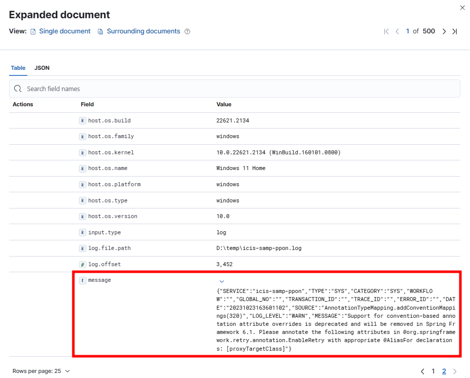
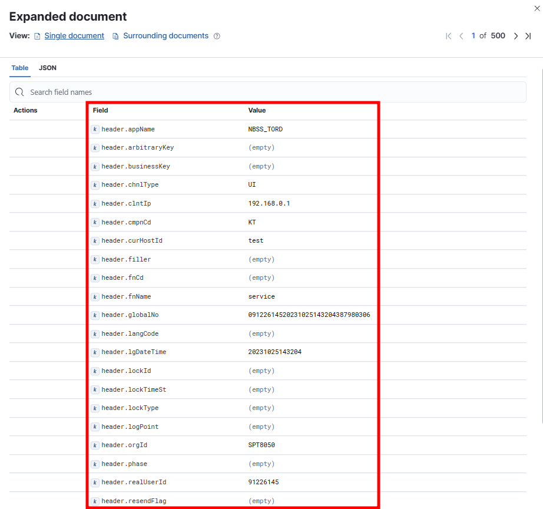

# Custom Logs 사용하기

본 교육에서는 Custom Log Integration을 활용하여 기 생성된 로그파일로 데이터 Parsing 및 대시보드 생성을 진행한다.


## 1) Custom Log Integration 설치

* 왼쪽 상단 ☰ 메뉴를 클릭하고 Management > Integration을 선택한다.

 


* Integration > custom으로 검색 > Custom logs를 선택한다.

 


* Custom Logs > Add Custom Logs를 선택한다.

 


* ① Configure integration

  * Integration name
    * ap-sample-log
  * Log file path (D:\ \backslash 2개를 입력해야한다. )
    * git에서 다운받은 경로 sample 폴더 경로를 입력한다.
    * D:\\*.log
  * Dataset name
    * ap-sample-log
  
* ② Existing hosts > 를 선택하고 Agent Policy 1 선택

 


* Save integration을 클릭한다.

 


* Save and deploy changes를 클릭한다.

 


## 2) Data view 생성하기

*  좀 전에 추가한 smaple-log만 검색하기 위해 Data view를 생성한다.
*  왼쪽 상단 ☰ 메뉴를 클릭하고 Analytics > Discover을 선택한다.

 


* Create data view
* Name
  * sample-aplog
* Index pattern
  * logs-ap*
* Save data view to Kibana


 


* 수집된 데이터를 확인해보면 metric 정보는 각 필드로 parsing되어있고 ap에서 남기는 로그는 message 항목에 저장된 것을 확인할 수 있다.

 


* 데이터 내용을 좀 더 쉽게 확인하기 위해 Ingetst Pipeline을 이용하여 message 필드 안에 있는 데이터를 Parsing 한다.


## 3) Ingest Pipeline 생성하기

* 수집한 로그를 원하는 형태로 표현하기 위해 Parsing 작업(필드 제거, 텍스트에서 값 추출, 데이터 보강 등)이 필요하다.
* Elasticsearch는 Ingest pipeline processor가 실행된 후 변환된 내용을 data stream 또는 index에 추가한다.
* 왼쪽 상단 ☰ 메뉴를 클릭하고 Management > Dev Tools를 선택한다.

 


* Dev Tools 에서는 elastic에서 제공하는 다양한 Rest API를 사용할 수 있다.

  > elastic rest api : https://www.elastic.co/guide/en/elasticsearch/reference/current/rest-apis.html

  ```json
  # (예시) disk 사용량 확인
  GET _cat/allocation?v
  
  # (예시) indices별 사용량 확인
  GET _cat/indices?bytes=b&s=store.size:desc,index:asc&v=true
  ```

  

* Dev Tools에 아래 내용을 복사하여 붙이고 실행 버튼을 클릭한다.

  * ignore_missing : 데이터가 없으면 parsing을 생략한다.

```json
PUT _ingest/pipeline/ap-log-pipeline-json
{
  "processors": [
    {
      "json": {
        "field": "message",
        "add_to_root": true
      }
    },
    {
      "remove": {
        "field": "message",
        "ignore_missing": true
      }
    },
    {
      "rename": {
        "tag": "1",
        "field": "SERVICE",
        "target_field": "service",
        "ignore_missing": true
      }
    },
    {
      "rename": {
        "field": "TYPE",
        "target_field": "type",
        "ignore_missing": true,
        "tag": "2"
      }
    },
    {
      "rename": {
        "field": "CTG",
        "target_field": "category",
        "ignore_missing": true,
        "tag": "3"
      }
    },
    {
      "rename": {
        "field": "CATEGORY",
        "target_field": "category",
        "ignore_missing": true,
        "tag": "3"
      }
    },
    {
      "rename": {
        "field": "WORKFLOW",
        "target_field": "workflow",
        "ignore_missing": true
      }
    },
    {
      "rename": {
        "field": "TRACE_ID",
        "target_field": "trace.id",
        "ignore_missing": true
      }
    },
    {
      "rename": {
        "field": "TRANSACTION_ID",
        "target_field": "transaction.id",
        "ignore_missing": true
      }
    },
    {
      "rename": {
        "field": "ERROR_ID",
        "target_field": "error.id",
        "ignore_missing": true
      }
    },
    {
      "date": {
        "field": "DATE",
        "formats": [
          "yyyyMMddHHmmssSSS",
          "yyyyMMddHHmmss"
        ],
        "target_field": "date",
        "if": "ctx['DATE'] != null"
      }
    },
    {
      "rename": {
        "field": "SOURCE",
        "target_field": "source.full",
        "ignore_missing": true
      }
    },
    {
      "dissect": {
        "field": "source.full",
        "pattern": "%{source.className}.%{source.methodName}(%{source.line})",
        "if": "ctx.source?.full != \"\"",
        "ignore_failure": true
      }
    },
    {
      "rename": {
        "field": "LOG-LEVEL",
        "target_field": "log.level",
        "ignore_missing": true
      }
    },
    {
      "rename": {
        "field": "HEADER",
        "target_field": "header",
        "ignore_missing": true
      }
    },
    {
      "rename": {
        "field": "MESSAGE",
        "target_field": "message",
        "ignore_missing": true
      }
    },
    {
      "remove": {
        "field": "DATE"
      }
    }
  ],
  "on_failure": [
    {
      "pipeline": {
        "name": "ap-log-parsing-error"
      }
    }
  ]
}
```


* ▶ 버튼을 클릭하여 작성한 내용으로 Pipeline을 생성한다.


 


* 정상적으로 생성 완료 시 200 - OK 응답을 받는다. 


* Ppipeline Parsing 에러 발생 시 처리를 위해 아래 내용을 입력하고 ▶ 버튼을 클릭한다.

  ```json
  PUT _ingest/pipeline/ap-log-parsing-error
  {
    "processors": [
      {
        "set": {
          "field": "ap-log-parsing-error",
          "value": "Processor [{{_ingest.on_failure_processor_type}}] with No. [{{_ingest.on_failure_processor_tag}}] in pipeline [{{_ingest.on_failure_pipeline}}] failed with message [{{_ingest.on_failure_message}}]"
        }
      }
    ]
  }
  ```


 

* 정상적으로 실행되면 200 - OK 가 나온다.

 


* Stack management > Ingest Pipelines 하위 Pipeline 이 2개 생성되었는지 확인한다.

 


* Dev Tools를 사용하지 않으면 아래 화면처럼 컬럼 단위로 하나씩 Parsing 처리를 해줘야한다.

  * processor 추가

  

  

  * Processor 유형 : JSON
  * Field : message -> message 컬럼을 Root로 지정하고 message 필드 안에 있는 필드를 하나씩 추출예시

  

  

  * Processor : remove 불필요한 필드 삭제 예시

  
  
  

## 4) Ingest Pipeline 테스트 하기

* Ingest pipelines > ap-log-pipeline-json을 클릭하고 오른쪽 하단의 Manage를 클릭한다.

  

* 오른쪽 하단 Test pipeline: Add documents를 클릭한다.
  

  

* 브라우저에서 탭은 하나 더 복제하여 연다.

  * Discover > edu-aplog를 선택하고 Document 확장 버튼을 클릭하여 document id와 index명을 확인한다.

  


* 확인한 내용으로 테스트할 pipeline 정보를 입력한다.

 

* Test pipeline을 실행한다.

 

* 테스트 결과 확인을 위해 View output을 클릭한다.

 


* 아래와 같이 parsing 결과를 확인할 수 있다.

 


## 5) 추가 Parsing 정보 입력 하기

* 로그를 수집하다보면 불필요한 로그도 수집되므로 제외가 필요한 경우 drop_event를 추가한다. 
* Fleet > Agent policies > Agent policy 1 선택
   


* processors 보완 처리

  * Custom log file > Advanced options 을 클릭한다.

   

  * Processors에 drop_event를 추가한다.

    ```json
    - drop_event:
        when:
          regexp:
            message: '^[^{]'
    ```

  * Custom configurations에 아래 내용을 추가한다. > 설명 보완해야함... java에서 뭔가 처리하는 내용인듯..

    ```json
    ndjson.target: ""
    ndjson.add_error_key: true
    ndjson.ignore_decoding_error: true
    multiline.type: pattern
    multiline.pattern: '(^[[:space:]]|^}|^java)'
    multiline.negate: false
    multiline.match: after
    ```


​	  

## 6) 작성한 pipeline 연결하기

* Add custom pipeline을 선택한다.

 

* "Add a processor"를 클릭한다.

 


* 아래의 내용으로 신규 Pipeline을 추가한다.

  * Processor : Pipeline
  * Pipeline name : ap-log-pipeline-json
  * Add Processor 선택

 


   


* 오른쪽 하단 Save integration을 클릭한다.

 


* Save and deploy changes 버튼을 클릭한다.

 


* 신규로 수집되는 데이터 부터 변경된 Pipeline이 적용되므로 로그 수집 경로에 log 파일을 하나 더 복사해서 붙여 넣는다. 

 


* Message 필드 안에 있던 데이터들이 각각의 Field로 분리된 것을 확인할 수 있다.