# Kibana 사용 가이드


## 1) Analytics > Discover

#### Discover 개요

Discover에서는 모든 유형의 데이터(APM, Log, Metric)를 테이블 형태로 볼 수 있다.

예를 들어, ap-logs 데이터뷰를 선택하면 ap에서 남기는 Log를 볼 수 있고, system-metrics을 선택하면 system에서 발생한 metric을 볼 수 있다. 


 

#### 데이터 뷰 선택하기

- 데이터 뷰 : 인덱스들의  모음
- 해당 데이터 뷰에 속하는 document (log)들이 6번 영역에 테이블 형태로 나온다.


####  필터 사용하기

- \+ 버튼을     클릭하면 다음과 같이 필터를 추가할 수 있다. 

  


- 필터를 추가하면 아래와 같이 하단에 필터 목록을 확인할 수 있다.

  


- 하나의 필터에 여러 개의 필터링 조건을 달 수 있고, 이름을 지정할 수 있다. 


  
  
  1. 필터 지정
  2. AND 혹은 OR 조건 추가
  3. 추가 필터 지정
  4. 필터 이름 지정

 

- 컬럼의 특정 값으로 필터 쉽게 지정

- +혹은 - 버튼을 클릭하여 컬럼 내의 특정 값으로 필터를 지정할 수 있다.


#### KQL 사용하여 검색하기

##### 1) 문자열 검색

- document 내에서 텍스트 문자열로 검색할 때 사용한다. 
  
  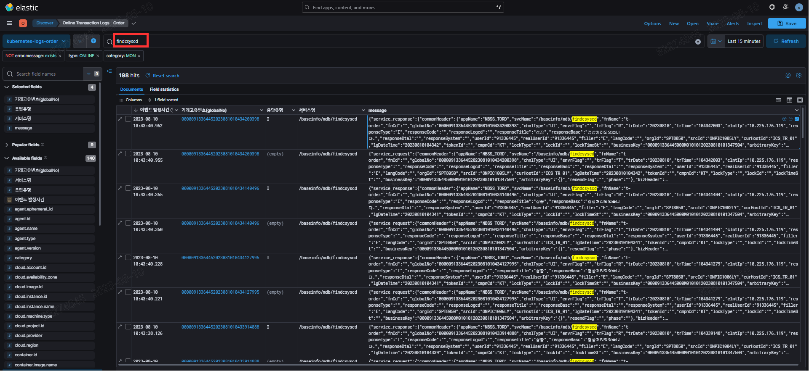
  
  

##### 2)  **특정 필드 검색**

- 특정 필드에 하나 이상의 term (검색 용어)이 포함되어 있는지 검색한다. 

- 이때 필드명은 원본으로 검색해야 한다. 임의로 custom한 필드명으로는 검색이 되지 않는다. 

- 아래는 특정 필드로 문서를 검색한 예시이다. 

  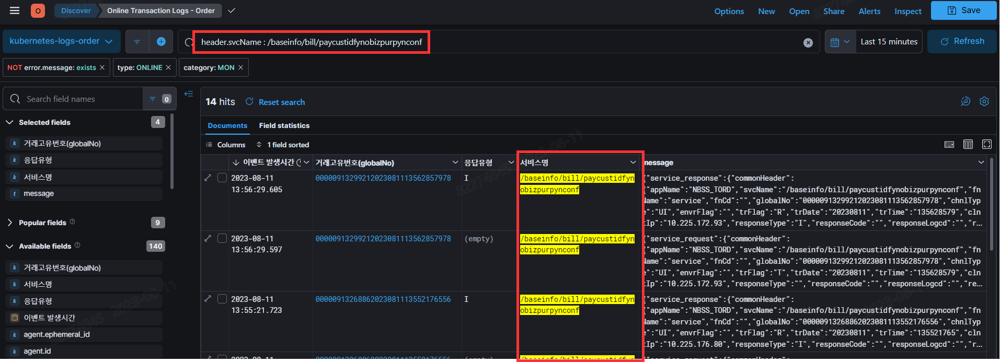

💡**주의사항**

* 만약 필드명을 수정했을 경우, 검색할때는 원본 필드명으로 검색해야 한다. 

- 띄어쓰기를 기준 단위로 검색 가능하다. 위 예시에서 baseinfo로 검색하면 검색이 되지 않는다. 

- 정확히 일치하는 문장을 검색하는 경우 쌍따옴표(")로 묶어준다.
  예) message :  "elastic search test"

- 문장에 쌍따옴표(")을 붙이지 않고 검색을 하면, 단어 순서와 상관없이 모두 검색된다.
  예) message : elastic test search
  위의 경우, elastic search test도 검색이 된다. 

- 특정 필드를 지정하지 않고 검색하면 모든 필드에 대해 검색을 실시한다.
  예 : elastic test exam

##### 3) Boolean  검색

* OR, AND, NOT 연산자를 기본으로 지원하며, AND가 OR 보다 높은 우선순위를 갖는다. 

* 소괄호()로 묶어 우선순위를 지정할 수 있다. (대소문자를 구분하지 않는다.)

  예1) http 메소드가 GET**이거나** status_code가 400인 문서를 찾는다. 

```
http:request.method: GET OR http:response.status_code: 400
```

​	예2) http 메소드가 GET**이고** status_code가 400인 문서를 찾는다. 

```
http:request.method: GET AND http:response.status_code: 400
```


##### 4) 범위 검색

* ">, >=, <, <=**" 를 사용하여 검색한다. 
* 예) 현재보다 2주 전 이후의 데이터를 검색한다. 

```
@timestamp > now-2w 
```

 

##### 5)  존재 여부 검색

* 특정 필드의 값이 존재하는 문서를 검색한다. 
  예) globalNumber가 존재하는 문서를 검색한다.

```
header.globalNo: *
```


##### 6) 와일드 카드 검색

* header.svcName이 /baseinfo로 시작하는 문서들 검색

```
header.svcName: /baseinfo*
```

 

#### **검색 기간 설정하기**

- 로그가 발생한 기간을 기준으로 검색할 수 있다. 

  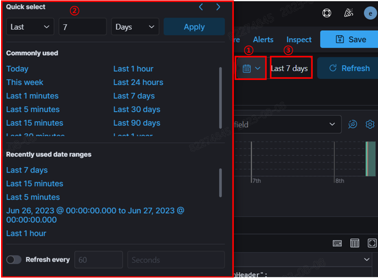

  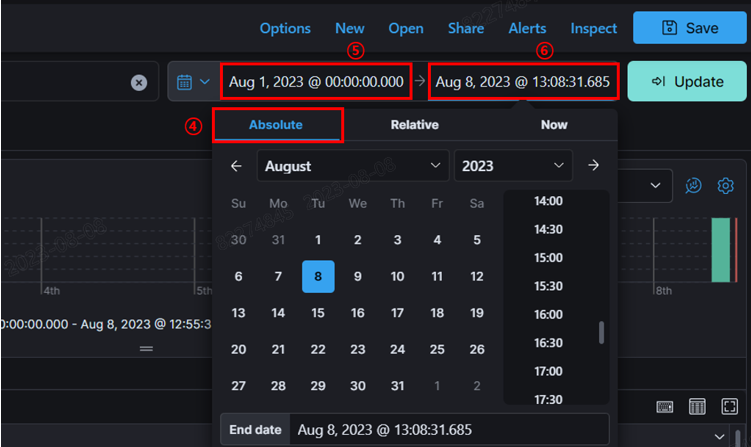


1. 달력 아이콘 클릭하면 현재시간을 기준으로 과거 특정 시점까지 선택할 수 있는 뷰가 나타난다.
2. 특정 시점을 선택하면 해당 시점부터 현재까지 발생한 로그 document들을 확인할 수 있다. 
3. 3번 위치를 클릭하면 아래 화면이 나타난다. 
4. Absolute를 클릭하면 5번 위치에 로그 발생 시작 시점을, 6번 위치에 끝나는 시점을 선택할 수 있다. 


#### Document Table 설정하기 

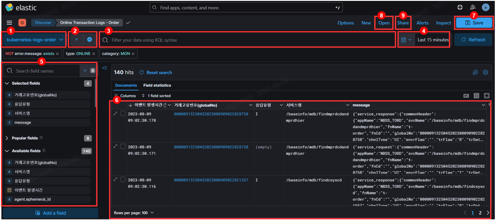


- 5번 영역에서 필드를 선택하면 6번 영역에 컬럼으로 나타난다. 

- 다음과 같이 Columns를 클릭하여 컬럼의 순서를 변경할 수 있다. 
  
    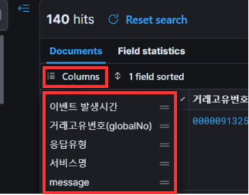

* 컬럼명 재설정 및 링크 걸기

  1, 2. 수정할 컬럼을 클릭하여 드롭다운 된 메뉴 중 Edit data view field를 선택한다. 

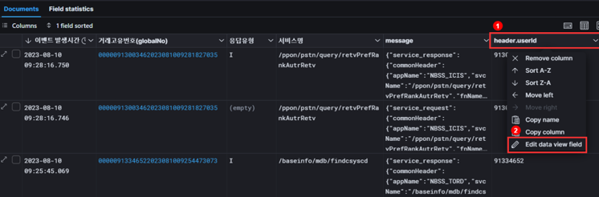

3. custom label 을 활성화 시키고, 수정하고자 하는 컬럼명을 작성한다.

4. 해당 컬럼 값에 URL을 지정하고 싶으면 Set Format을 활성화시키고 타입을 Link로 세팅후, URL template을 작성한다.
   이때, 컬럼 값을 URL의 일부로 지정하고 싶으면 Label template에 해당 값의 변수를 지정하고, 해당 변수를 url의 일부로 작성한다. 

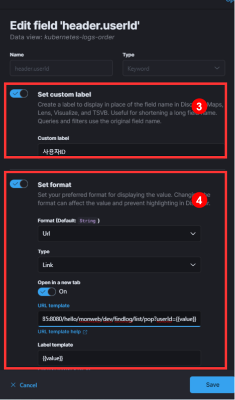


#### 메시지 자세히 보기 

- 1번 버튼을 클릭하면 2번 화면에서 상세 로그를 필드별로 확인 할 수 있다. 
  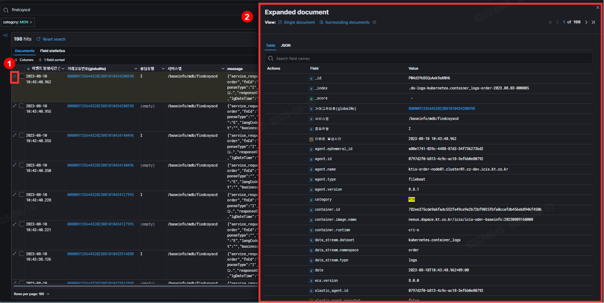


#### 사용자가 생성한 Search 저장

- 1~6까지 사용자가 생성한 Search를 저장한다. 
  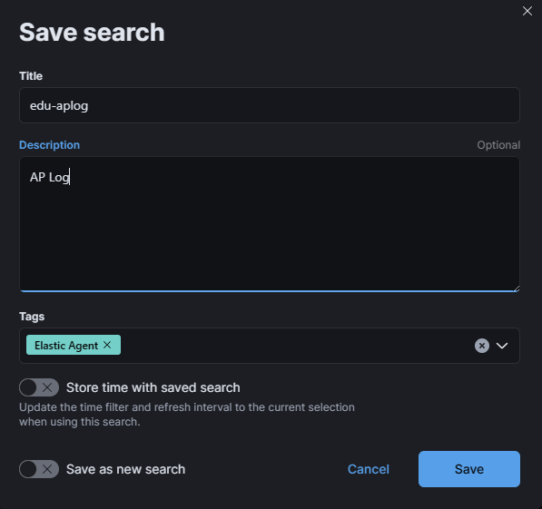


 

#### 사용자가 저장했던 Search 목록 가져오기

- 7에서  사용자가 저장한 Search 목록을 불러올 수 있다. 

  


#### 생성한 Search를 공유하기 

1. 상단의 share 버튼을     클릭하여 search를 link로 공유하거나 csv 파일로 변환하여 저장할 수 있다. 
2. Get link 클릭 시 Short URL, Public URL을 활성화하여 단축된 URL로 공유할 수 있다. 
3. CSV     Reports 클릭 시 search를 csv 파일로 변환하여 저장할 수 있다. 
   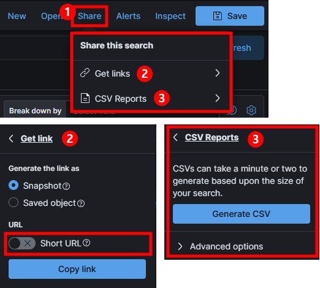


## 2) Analytics > Dashboard

#### Dashboard

- 앞서 Discover에서는 모든 유형의 로그를 테이블 형태로만 확인할 수 있었다. 

- 로그들을 테이블 형태가 아니라 시각화하여 보기 위해서는 Dashboard를 활용할 수 있다. 

  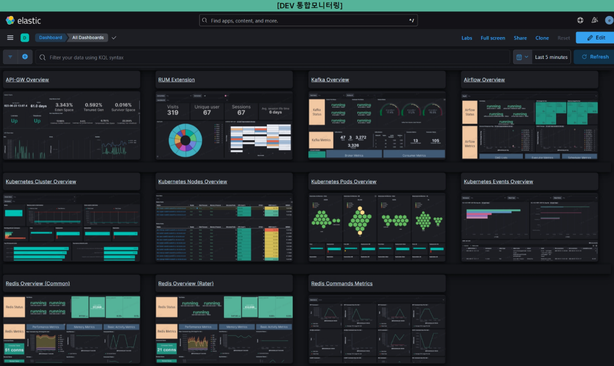


## 3) Observability > Overview

 

#### Observability 개요

Observability는 사용자 환경에서 실행되는 애플리케이션의 동작에 대한 세분화된 통찰력과 컨텍스트를 제공함으로써 시스템 내에서 근본 원인 이벤트를 지체없이 감지하고 조치할 수 있게 도와준다.

Elastic Observability는 단일 스택을 통해 로그, 메트릭, 애플리케이션 트레이싱, 엔드포인트 업타임, UX 데이터(RUM)을 통합하여 가시성을 제공하고 최근 버전부터는 Synthetic(User journey), Profiling 기능까지 추가되어 더욱 세분화된 통찰력과 컨텍스트를 제공하고 있다.

또한, 수집된 데이터를 기반으로 Kibana에서 대시보드를 생성 시각화하고 사용자 관심사항에 따른 알림(Alert)을 설정하여 즉각적인 상황인지 및 의사결정에 도움을 준다.


## 4) Observabilty > Logs 


#### Logs Stream

Logs의 Steam은 호스트, 서비스, Kuberentes 등의 로그 데이터를 최신순으로 tailing하여 라이브 스트리밍 기능을 제공한다. 


① KQL(Kibana Query Language) 혹은 Elasticsearch Query DSL을 사용하여 로그 검색 혹은 필터링 적용. Highlights을 통해 특정 키워드에 대해 하이라이팅 가능.

② 선택된 컬럼만 화면에 표시됨.

③ 라이브 스트리밍 기능을 활성화하면 주기적으로 업데이트하여 최신 로그 데이터 자동 조회 가능.

④ 시간에 따른 로그 데이터량 추이.

⑤ document(건)별 컬럼 값. 해당 document에 컬럼이 없거나 null일 경우 공백으로 표시됨.


#### Logs 설정

Logs는 Settings와 Alerts and rules 메뉴를 통해 상세 설정을 할 수 있다.


Settings을 통해 조회하고자 하는 인덱스, data-stream을 선택할 수 있고 확인하고자하는 필드(컬럼)만 선택할 수 있습니다.

#### Settings

Settings에서는 조회하고자 하는 인덱스, data-stream을 선택할 수 있고 확인하고자하는 필드(컬럼)을 선택할 수 있다.


① 데이터 소스 선택. Data view 혹은 인덱스패턴으로 설정 가능
② 컬럼 선택.

#### Alerts & Rules

Alerts and rules을 통해 사용자정의 임계치 기반 규칙(ex. 에러코드가 4xx 이상인 로그가 최근 5분 동안 50개 이상)에 따른 알림을 설정하여 이상징후를 탐지 할 수 있다.
(임계치 기반 규칙 설정. 조건, 범위, 그룹핑, 탐지 주기 등)


