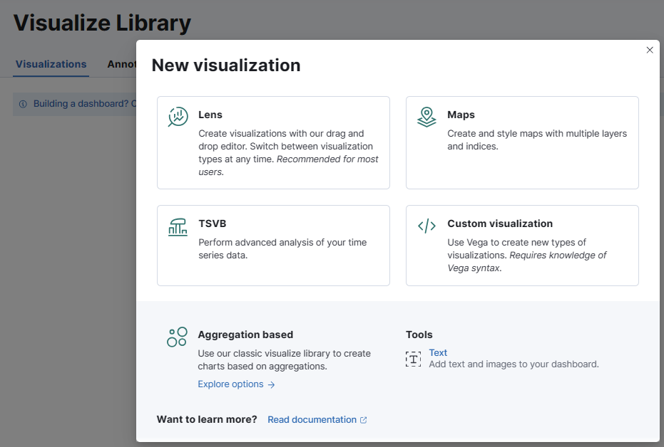
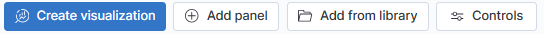
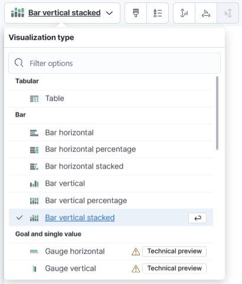
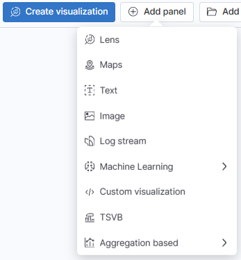
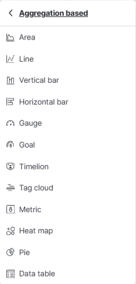
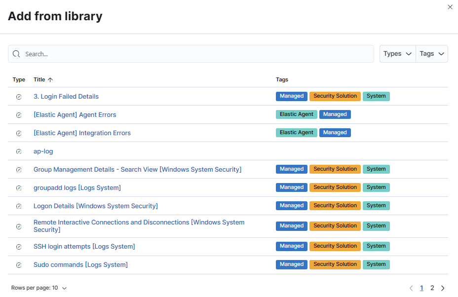
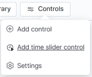

# Dashboard 생성하기

* 시각화 도구는 Visualization Library 또는 Dashboard 메뉴에서 생성할 수 있다.

## 1) Visualization Library

Menu (☰ 버튼) → Visualize Library 화면에서 우측 상단의 "Create visualization"을 클릭하면, 여러가지 시각화 도구를 만들 수 있는 팝업이 나타난다. 원하는 도구를 선택하여 데이터를 시각화한다.

 

 

## 2) Dashboard에서 바로 생성하기

* 오른쪽 상단 "Create dashboard" 클릭

* Dashboard 신규 생성 화면

    

  * Create visualization : Drag & Drop 형태의 간단한 시각화 도구

   

  

  * Add panel

     

    

    * Lens : Drag & Drop 형태의 간단한 시각화 도구

    * Maps : 지도를 바로 생성할 수 있는 도구

    * Text : 기본 텍스트를 입력할 수 있는 기능

    * Image : 그림이나 사진을 입력할 수 있는 기능

    * Log stream : 라이브 스트리밍 로그 테이블

    * Machine Learning : 이상 탐지 결과 시각화 도구

    * Custom Visualization : Vega를 사용하는 시각화 도구

    * TSVB : 타임 시리즈 데이터 분석 도구

    * Aggregation based : 집계 기반 시각화 도구 (자세한 내용은 하단 기술)

      

     

    

    * Area : 측과 선 사이의 데이터를 강조하는 도구 
    * Gauge : 메트릭의 상태를 표시하는 도구
    * Goal : 목표를 향해 진행되는 방식을 표시하는 도구
    * Heat map : 값을 각각 다른 색상으로 표시하는 도구
    * Vertical bar : 세로로 표시되는 막대 그래프
    * Horizontal bar : 가로로 표시되는 막대 그래프
    * Line 라인으로 표시되는 그래프 
    * Metric : 계산을 통한 단일 숫자를 표시하는 도구
    * Pie : 파이 그래프
    * Data table : 데이터 테이블
    * Tag cloud : 글자의 사이즈 조절을 통해 단어의 빈도수를 표시해주는 도구
    * Timelion : 그래프에 타임시리즈 데이터를 표시하는 도구

  

  * Add from library  : 기존 Visualize Library에서 만들었던 내용을 불러오는 버튼

     

    

  * Controls : 대시보드에 필터를 적용할 수 있는 조작패널을 추가하는 버튼

     

